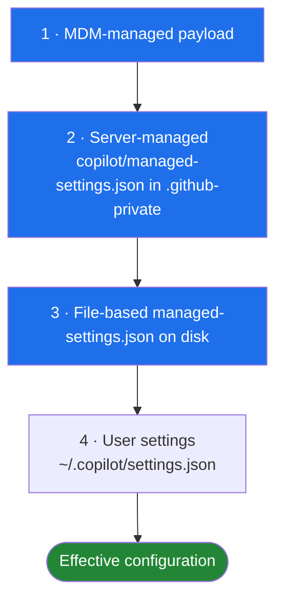
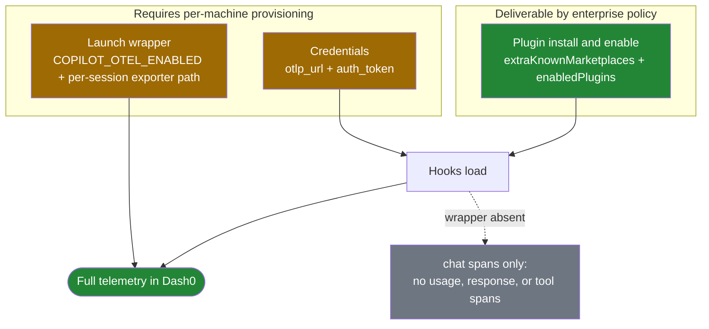

# Dash0 Agent Plugin

Emit GitHub Copilot CLI agent activity as OpenTelemetry spans to your Dash0 endpoint — prompts and responses, tool calls, MCP calls, and sub-agent activity, with shared trace context across each turn.

**Requirements:** the GitHub Copilot CLI, on macOS or Linux.

## Installation

Add the Dash0 marketplace, then install the plugin from it:

```bash
copilot plugin marketplace add dash0hq/dash0-agent-plugin
copilot plugin install dash0-agent-plugin@dash0
```

The marketplace entry (`.github/plugin/marketplace.json`) points at the `copilot/` package, so `@dash0` installs exactly it — versioned, so `copilot plugin update dash0-agent-plugin` picks up new releases. On the first hook fire the `copilot-on-event` binary is fetched from [GitHub Releases](https://github.com/dash0hq/dash0-agent-plugin/releases) — verifying the checksum — into `~/.local/state/dash0-agent-plugin/copilot/bin/`.

After installing, **restart `copilot`** (hooks load at startup).

## Configure

Run the configure skill inside Copilot:

```
/dash0-configure
```

It does two things:

1. Writes your Dash0 credentials to `~/.copilot/dash0-agent-plugin.local.md` (chmod 600) — or, if you choose project scope, to `.copilot/dash0-agent-plugin.local.md` in the current workspace.
2. Installs a **launch shell function** that shadows `copilot` to enable Copilot's native OpenTelemetry into a per-session file. Open a new shell afterward.

**Why the launch function matters:** Copilot's native OTel is the source of per-turn token/cost/model usage, the agent response, and all tool spans — Copilot cannot enable it from a hook, and it does not hand the file path to hooks, so the launcher owns it. A `copilot` started from a shell without the function still emits one `chat` span per turn, just without usage, response, or tool detail (graceful — never an error).

Prompt mode (`copilot -p`) fires the hooks too, so headless runs are instrumented when launched via the function.

## Upgrading

```bash
copilot plugin update dash0-agent-plugin
```

It fetches the latest release and leaves your credentials and launch function untouched. Restart `copilot` to pick up the update.

## Configuration

After installing, you'll need:

- **Auth token** — create one from your organization's [Auth Tokens settings page](https://app.dash0.com/settings/auth-tokens). Use an ingest-only token with permissions limited to the dataset you want to send data to.
- **OTLP endpoint URL** — find it in the [Endpoints settings page](https://app.dash0.com/settings/endpoints) under the OTLP via HTTP tab (e.g. `https://ingress.<region>.aws.dash0.com`).

### Config file

The config file lives at `~/.copilot/dash0-agent-plugin.local.md` (chmod 600 — it holds your token in cleartext). YAML frontmatter:

```yaml
---
otlp_url: "https://ingress.<region>.aws.dash0.com"
auth_token: "<your-dash0-auth-token>"
dataset: "default"                  # optional
agent_name: "github-copilot-cli"    # optional — used as service.name
team_name: "<your-team>"            # optional — tagged as dash0.team.name on every span
---
```

`/dash0-configure` writes this file for you. To reconfigure later, edit it directly — see [Options](#options) for every key. Changes take effect on the next hook fire — no restart needed.

Config can be **user-level** (`~/.copilot/dash0-agent-plugin.local.md`, applies to all projects) or **project-level** (`.copilot/dash0-agent-plugin.local.md` in a workspace). A project-level file takes precedence over the user-level one and replaces it entirely — the two are not merged.

### Verify

Send a prompt that uses a tool. In Dash0 you should see one trace per turn with:

- one `chat <model>` span at turn end carrying `gen_ai.usage.input_tokens`, `output_tokens`, and `cache_read.input_tokens`
- one `execute_tool <Name>` span per tool call, with `parentSpanId` pointing at the chat span
- the same `traceId` on every span in the turn

Sub-agent tool calls (spawned via the `task` tool) nest under their spawning `task` span, and MCP calls carry `dash0.gen_ai.tool.mcp_server`. If you see `chat` spans but no usage or `execute_tool` spans, the launch function isn't active — open a new shell (or re-run `/dash0-configure`).

### Options

| Option | Description | Default | Sensitive |
|---|---|---|---|
| `otlp_url` | Dash0 OTLP endpoint URL (e.g. `https://ingress.<region>.aws.dash0.com`) | — | No |
| `auth_token` | Dash0 authentication token | — | Yes (config file, chmod 600) |
| `dataset` | Dash0 dataset name | — | No |
| `agent_name` | Agent name (used as `service.name`) | `github-copilot-cli` | No |
| `team_name` | Team name — all spans are tagged with `dash0.team.name` | — | No |
| `omit_io` | Omit prompt content and tool I/O | `true` | No |
| `omit_user_info` | Anonymize user identity | `false` | No |
| `debug` | Print OTel payloads to stderr (and `debug_file` if set) | `false` | No |
| `debug_file` | Write debug output to this file path | — | No |

Set `enabled: false` in the config file to disable the plugin without uninstalling it.

### Precedence

When a value is set in more than one source, highest wins:

1. Project-level config file (`.copilot/dash0-agent-plugin.local.md`)
2. User-level config file (`~/.copilot/dash0-agent-plugin.local.md`)
3. `DASH0_*` environment variables

### Environment variable fallback

The plugin falls back to `DASH0_*` environment variables when the config file doesn't set a value. Useful for CI or development.

| Variable | Description |
|---|---|
| `DASH0_OTLP_URL` | OTLP endpoint URL |
| `DASH0_DATASET` | Dataset name |
| `DASH0_AGENT_NAME` | Agent name |
| `DASH0_TEAM_NAME` | Team name |
| `DASH0_OMIT_USER_INFO` | Anonymize user identity (`true`/`false`) |
| `DASH0_OMIT_IO` | Omit prompts and tool I/O (`true`/`false`) |
| `DASH0_DEBUG` | Print OTel payloads to stderr (`true`/`false`) |
| `DASH0_DEBUG_FILE` | Write debug output to this file path |

> `auth_token` has **no `DASH0_AUTH_TOKEN` env var fallback** — it is never read from a `DASH0_*` variable to prevent leaking into tool-spawned shell environments. Set it via the config file's `auth_token:` field (the bootstrap passes it to the hook as `COPILOT_PLUGIN_OPTION_AUTH_TOKEN`).

## Organization-wide deployment

Copilot CLI has an enterprise policy layer that mirrors Claude Code's managed settings, down to the filename. It can install and enable this plugin across a fleet without any user action. It cannot deliver the plugin's configuration, so a Copilot rollout is a two-channel operation — policy for the install, device provisioning for the credentials — where the equivalent Claude Code rollout is a single JSON payload.

*Researched against GitHub documentation and the `github/copilot-cli` issue tracker on 2026-07-31; bug reports below were filed against Copilot CLI v1.0.75. Unlike the Claude Code guide, none of this has been executed against a live enterprise account — treat the payloads as documentation-derived, and re-verify the schema against the [managed settings reference](https://docs.github.com/en/copilot/reference/enterprise-managed-settings-reference) before a customer rollout.*

### How Copilot resolves managed settings

An enterprise owner publishes settings through one of three channels, and Copilot merges them with the user's own settings before startup. Resolution happens **per key** rather than per channel, which is the significant difference from Claude Code: where a single server-delivered key in Claude Code discards an entire MDM payload, Copilot fills gaps downward, so MDM wins for the keys it sets and the server supplies the rest.



The server-managed channel reads `copilot/managed-settings.json` from a repository named `.github-private` on the enterprise's default branch, refreshing roughly hourly and on restart or re-authentication, with the last fetch cached for offline starts. The file-based channel reads a platform path: `/etc/github-copilot/managed-settings.json` on Linux, `/Library/Application Support/GitHubCopilot/managed-settings.json` or the `com.github.copilot` plist domain on macOS, and `%ProgramFiles%\GitHubCopilot\managed-settings.json` or `HKLM\SOFTWARE\Policies\GitHubCopilot` on Windows.

> **GitHub's own documentation contradicts itself on whether managed settings are enforcement or merely a default.** The enterprise reference states that the `managed-settings.json` value takes precedence over any file-based configuration a user sets, and orders the sources MDM → server → file → user, as diagrammed above. The CLI config reference orders them the other way for most keys, applying MDM "as a policy baseline" that "user settings can override," and names `permissions.disableBypassPermissionsMode` as the one key where a managed value always wins. Naming a single exception implies the rest are overridable. The two pages cannot both be right. For `telemetry` specifically the question is settled in favor of enforcement — see [Routing Copilot's native telemetry instead](#routing-copilots-native-telemetry-instead) — but for `enabledPlugins` it is unresolved, and [#4283](https://github.com/github/copilot-cli/issues/4283) is a case of the user-settings side winning in practice. Treat any key other than `telemetry` as a strong default rather than a guarantee until tested.

Three scoping limits matter when qualifying a customer. Managed settings apply **enterprise-wide with no organization-level override**, so a single organization inside a larger enterprise cannot deploy this for itself — a real constraint that has no Claude Code equivalent, where Team plans can. Content exclusion, which enterprises often assume covers everything, [does not apply to Copilot CLI](https://docs.github.com/en/copilot/how-tos/configure-content-exclusion/exclude-content-from-copilot) at all. And an enterprise dedicated to Copilot Business (sometimes called Copilot Standalone) has no organization to hold `.github-private`, so using the server-managed channel at all requires giving one user a GitHub Enterprise license to create the organization and repository, then designating it as the source of governance. MDM and file-based delivery need neither.

### Installing the plugin fleet-wide

Two keys do the work. `extraKnownMarketplaces` makes the Dash0 marketplace resolvable, and `enabledPlugins` triggers the install — per GitHub's plugin standards, "if managed settings define a plugin using `enabledPlugins`, the client automatically tries to install it." Place this at `copilot/managed-settings.json` in the enterprise's `.github-private` repository:

```json
{
  "extraKnownMarketplaces": {
    "dash0": {
      "source": { "source": "github", "repo": "dash0hq/dash0-agent-plugin" }
    }
  },
  "enabledPlugins": {
    "dash0-agent-plugin@dash0": true
  }
}
```

> The inner key is `source`, not `type` — the marketplace object wraps a `source` property whose own discriminator is also called `source`. The `github` type additionally accepts `ref` (branch, tag, or SHA) and `path` (subdirectory). Because the marketplace manifest lives at [`.github/plugin/marketplace.json`](marketplace.json), which is one of the paths Copilot checks by default, no `path` is needed here.

`strictKnownMarketplaces` confines plugin installation to marketplaces the enterprise has approved, and is worth pairing with the above so Dash0 is the only marketplace developers can install from. It is an **array of marketplace objects**, not a boolean — an empty array is a complete lockdown:

```json
{
  "strictKnownMarketplaces": [
    { "source": "github", "repo": "dash0hq/dash0-agent-plugin" }
  ]
}
```

One caveat in GitHub's guidance does not bite here. `enabledPlugins` makes each client install the plugin on behalf of its user, so that user needs read access to wherever the plugin is hosted — a plugin in a private repository can fail to install for exactly the developers the policy was meant to cover, and may require a license to fix. The Dash0 marketplace is a public repository, so authorization is never the failure mode.

Verify the install half before relying on it. [github/copilot-cli#4283](https://github.com/github/copilot-cli/issues/4283) is open against v1.0.75: server-managed `enabledPlugins` installs the plugin but persists `enabled: false`, because an empty `enabledPlugins: {}` in the user's local `settings.json` is treated as authoritative. Hooks never load, and the documented workaround — adding the same entry to each user's local settings — defeats the point. A closely related bug, [#4039](https://github.com/github/copilot-cli/issues/4039), was fixed in v1.0.68 after marking plugins installed against a `cache_path` that was never populated.

### What policy cannot deliver

The managed-settings key set documented for all clients is `permissions.disableBypassPermissionsMode`, `model`, `enabledPlugins`, `extraKnownMarketplaces`, `strictKnownMarketplaces`, `telemetry`, and `remoteControl`. The MDM tier accepts three more that the enterprise reference table omits: `allowedMcpServers`, `deniedMcpServers`, and `shellShortcut`. Write `model` at the top level; the older nested `permissions.model` still resolves as a fallback but should not be used in new payloads.

There is no `env` key anywhere in that set, and `enabledPlugins` entries take a boolean — enable or disable, with no configuration payload. Copilot's plugin manifest format compounds this: it defines `name`, `description`, `version`, `author`, `license`, `keywords`, `agents`, `skills`, `hooks`, and `mcpServers`, but nothing equivalent to Claude Code's `userConfig`. This plugin's [`copilot/plugin.json`](../../copilot/plugin.json) therefore declares no options at all, and every value is read from the config file that [`copilot-on-event.sh`](../../copilot/copilot-on-event.sh) parses at hook time.

A fleet-wide `enabledPlugins` push consequently produces an installed plugin that starts up configured with nothing. Two of the three things this plugin needs have to arrive by device provisioning:



The missing central-configuration capability is tracked as [github/copilot-cli#3909](https://github.com/github/copilot-cli/issues/3909), which names Claude Code's server-managed settings as the parity target it wants: "Org admins have no way to centrally push configuration — especially environment variables — to developers' local Copilot CLI installs." It remains open.

### Provisioning credentials and the launch wrapper

The most durable machine-local channel is Copilot's **policy hooks** tier, which is separate from managed settings. Copilot loads `/etc/github-copilot/policy.d/*.json` on Linux and macOS, and `C:\ProgramData\GitHub\Copilot\policy.d\*.json` on Windows, in alphabetical order and ahead of user, project, and plugin hooks. The documentation is explicit that these "cannot be disabled by `disableAllHooks` and are available regardless of folder trust state," and that end users cannot modify them. Because a hook entry accepts an `env` block, an administrator can inject `COPILOT_PLUGIN_OPTION_AUTH_TOKEN` and `DASH0_OTLP_URL` at the hook level, tamper-resistant in a way the config file is not.

Provisioning the config file directly is the simpler alternative: write `~/.copilot/dash0-agent-plugin.local.md` with mode 600 through the same tooling that seeds dotfiles. It reuses the supported path and needs no hook plumbing, at the cost of being user-editable.

The launch wrapper cannot be reduced to static environment variables, which is the part most likely to be got wrong. Copilot's native OTel is the source of per-turn token, cost, and model usage, the agent response, and every tool span, and it is enabled by variables read from `copilot`'s own process environment — not the hook's. `COPILOT_OTEL_ENABLED=true` could be exported system-wide from `/etc/profile.d`, but `COPILOT_OTEL_FILE_EXPORTER_PATH` must be unique per session; a fixed value makes concurrent sessions interleave their writes into one file. Provisioning therefore has to install the shell function itself — the same one [`/dash0-configure`](../../copilot/skills/dash0-configure/SKILL.md) writes, which derives the path from `$$` and `$RANDOM` — into a system-wide shell profile such as `/etc/profile.d/dash0-copilot.sh`. Skipping it is not fatal: hooks still emit one `chat` span per turn, without usage, response, or tool detail.

### Routing Copilot's native telemetry instead

The `telemetry` managed key is the one place GitHub already ships an endpoint and credentials centrally. It went [generally available on 2026-07-08](https://github.blog/changelog/2026-07-08-enterprise-managed-opentelemetry-export-for-vs-code-and-cli/) and accepts `enabled`, `endpoint`, `protocol`, `headers`, `serviceName`, `resourceAttributes`, `captureContent`, and `lockCaptureContent`. Because Dash0's OTLP contract is a base URL plus `Authorization` and `Dash0-Dataset` headers, it maps onto that schema directly:

```json
{
  "telemetry": {
    "enabled": true,
    "endpoint": "https://ingress.<region>.aws.dash0.com",
    "protocol": "http/json",
    "serviceName": "github-copilot",
    "captureContent": false,
    "lockCaptureContent": true,
    "resourceAttributes": { "deployment.environment": "production" },
    "headers": {
      "Authorization": "Bearer <DASH0_AUTH_TOKEN>",
      "Dash0-Dataset": "default"
    }
  }
}
```

This is the only part of a Copilot rollout that is genuinely zero-touch: no plugin, no config file, no launch wrapper, and it reaches the VS Code extension as well as the CLI. It is also the only key whose enforcement is documented rather than ambiguous — the changelog states that "a managed value always wins, taking precedence over environment variables and user settings," which closes the precedence question raised above and means a developer cannot redirect the export with `OTEL_EXPORTER_OTLP_ENDPOINT`. `lockCaptureContent` pins the prompt-capture decision the same way. The changelog also notes that managed exporter headers "are never passed through environment variables, so a value such as an authentication token can't leak into the tool subprocesses that the agent host spawns," which is a stronger guarantee than the config file offers.

The payload above specifies `http/json` deliberately. The reference documents `http/protobuf` as an accepted value, but [#2934](https://github.com/github/copilot-cli/issues/2934) is still open against protobuf support, so the two sources disagree and JSON is the value known to work. Dash0 accepts OTLP/HTTP JSON — it is what this plugin's own exporter posts — so nothing is lost by choosing it. Endpoints that reject JSON, such as Azure Monitor, are the reason #2934 remains a blocker for other backends.

Two further caveats before recommending it. Managed headers are **static and never refreshed** ([#3477](https://github.com/github/copilot-cli/issues/3477)), so rotating the Dash0 token means re-pushing managed settings and waiting out the hourly refresh. That is tolerable for Dash0 because ingest tokens are long-lived; it is what makes this path unusable for backends issuing short-lived credentials, and the reason the issue is still open. And a token in `headers` under the server-managed channel is committed in plaintext to `.github-private`, readable by anyone with access to that repository and preserved in its history. Prefer a narrowly scoped ingest-only token limited to the target dataset, and prefer MDM delivery where repository read access is broad.

#### Choosing between the two

The plugin path remains the default recommendation, because it is the one that produces the span shape the rest of this plugin's runtimes produce. Native export is the right answer when zero-touch matters more than enrichment, or as a first step while device provisioning is still being built. The two are not competing data sources so much as the same data with and without enrichment, since the plugin already consumes Copilot's native OTel output as its own upstream — which makes running both briefly a cheap way to compare, provided only one of them targets a given dataset at a time.

| | Plugin (policy install + provisioning) | Managed `telemetry` |
|---|---|---|
| Clients covered | Copilot CLI | Copilot CLI and VS Code |
| Developer action required | Credentials and launch wrapper per machine | None |
| Enforceable against a determined user | Unresolved, see [#4283](https://github.com/github/copilot-cli/issues/4283) | Yes, documented to beat env vars and user settings |
| Span shape | Canonical, shared with Claude Code, Cursor, and Codex | GitHub's GenAI semantic-convention shape |
| VCS and code enrichment (repo, branch, PR, issue, commit) | Yes | No |
| Signals | Traces only | Traces and metrics |
| Dataset routing | Per user or per project | Enterprise-wide, one `Dash0-Dataset` header |
| Token rotation | Re-provision the config file or policy hook | Re-push managed settings, static until then |
| Token exposure | Config file on disk, mode 600 | Plaintext in `.github-private`, or MDM payload |
| Sub-agent parenting | As described in [`copilot/README.md`](../../copilot/README.md) | Native `invoke_agent` spans, no plugin-side re-parenting |

### Where this leaves a Copilot rollout

Install is solved and centrally governable; configuration is not, and the launch wrapper makes device provisioning unavoidable for complete telemetry. An honest description to an enterprise is policy-managed installation plus MDM-delivered credentials and shell profile, with the caveat that #4283 currently undermines even the install half. Where that provisioning does not exist yet, managed `telemetry` is a working zero-touch fallback that gives up enrichment rather than correctness, and it covers VS Code as a bonus.

The comparison to state plainly is that Claude Code reaches the full-enrichment outcome with one payload and no device management, and that Copilot's gap is a tracked feature request rather than a design decision. Dash0's requirements are on record in [#3909](https://github.com/github/copilot-cli/issues/3909), including why a scoped per-plugin config map is preferable to a general `env` block. Revisit this section when that issue closes, and re-test the install half whenever #4283 moves.

### References

| Topic | Source |
|---|---|
| Managed settings keys and precedence | [Enterprise managed settings reference](https://docs.github.com/en/copilot/reference/enterprise-managed-settings-reference) |
| Delivery channels and `.github-private` setup | [Configure enterprise managed settings](https://docs.github.com/en/copilot/how-tos/administer-copilot/manage-for-enterprise/manage-agents/configure-enterprise-managed-settings) |
| Config directory and managed paths | [CLI config dir reference](https://docs.github.com/en/copilot/reference/copilot-cli-reference/cli-config-dir-reference) |
| Policy hooks tier and hook `env` | [Hooks reference](https://docs.github.com/en/copilot/reference/hooks-reference) |
| Auto-install semantics | [About enterprise plugin standards](https://docs.github.com/en/copilot/concepts/agents/copilot-cli/about-enterprise-plugin-standards) |
| Plugin manifest fields | [CLI plugin reference](https://docs.github.com/en/copilot/reference/copilot-cli-reference/cli-plugin-reference) |
| Content exclusion scope | [Exclude content from Copilot](https://docs.github.com/en/copilot/how-tos/configure-content-exclusion/exclude-content-from-copilot) |
| Native OTel span, metric, and event schema | [CLI command reference, OpenTelemetry monitoring](https://docs.github.com/en/copilot/reference/copilot-cli-reference/cli-command-reference#opentelemetry-monitoring) |
| Managed `telemetry` GA, precedence over env vars | [Enterprise-managed OpenTelemetry export changelog](https://github.blog/changelog/2026-07-08-enterprise-managed-opentelemetry-export-for-vs-code-and-cli/) (2026-07-08) |
| Central config gap | [copilot-cli#3909](https://github.com/github/copilot-cli/issues/3909) (open) |
| `enabledPlugins` enablement bug | [copilot-cli#4283](https://github.com/github/copilot-cli/issues/4283) (open) |
| Static exporter headers, no refresh | [copilot-cli#3477](https://github.com/github/copilot-cli/issues/3477) (open) |
| `http/protobuf` export support | [copilot-cli#2934](https://github.com/github/copilot-cli/issues/2934) (open, contradicts the reference) |
| Plugin cache sync bug | [copilot-cli#4039](https://github.com/github/copilot-cli/issues/4039) (fixed, v1.0.68) |

## Privacy defaults

| Setting | Default | Behavior |
|---|---|---|
| `omit_user_info` | `false` | Real `user.name` and `user.email` are sent. When `true`, `user.name` is a SHA-256 hash, `user.email` is omitted, working directory is redacted. |
| `omit_io` | `true` | Prompt content and tool call inputs/outputs are stripped from spans. |

## Telemetry attributes

Spans follow [GenAI semantic conventions](https://opentelemetry.io/docs/specs/semconv/gen-ai/).
The OTLP pipeline is shared across runtimes, so the attribute set matches Claude Code apart from the per-runtime differences noted in [FEATURE_MATRIX.md](../../FEATURE_MATRIX.md).

## Troubleshooting

If no traces arrive:

- Confirm you **restarted `copilot`** after installing (hooks load at startup).
- Confirm you opened a **new shell** after `/dash0-configure` so the launch function is active — without it, `chat` spans emit but carry no usage or tool spans.
- Enable the debug log — add `debug: true` and `debug_file: /tmp/dash0-copilot-debug.log` to `~/.copilot/dash0-agent-plugin.local.md`, then run Copilot and watch it:

  ```bash
  tail -F /tmp/dash0-copilot-debug.log
  ```

  Every emitted span is appended there as a `[dash0:trace] {...}` line. If spans are logged but don't reach Dash0, re-check `otlp_url` and `auth_token` in the config.

## Uninstall

```bash
copilot plugin uninstall dash0-agent-plugin
```

Then remove what the configure step added:

- delete the `# >>> dash0-agent-plugin (copilot) >>>` … `<<<` block from your shell profile (`~/.zshrc`, `~/.bashrc`, …),
- `rm ~/.copilot/dash0-agent-plugin.local.md`,
- `rm -rf ~/.local/state/dash0-agent-plugin/copilot` (cached binary + native-OTel files).

## Development

See [`copilot/README.md`](../../copilot/README.md) for how the runtime works and building/running local changes,
and [DEVELOPMENT.md](../../DEVELOPMENT.md) for releasing and cross-runtime reference.
